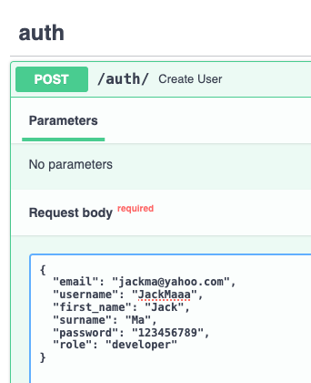
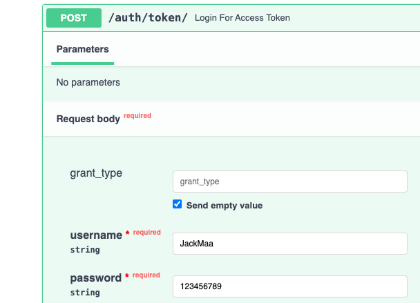
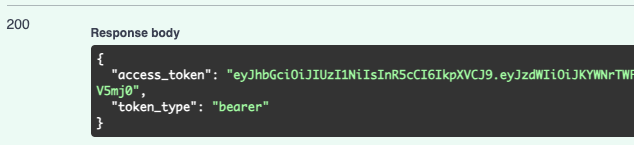
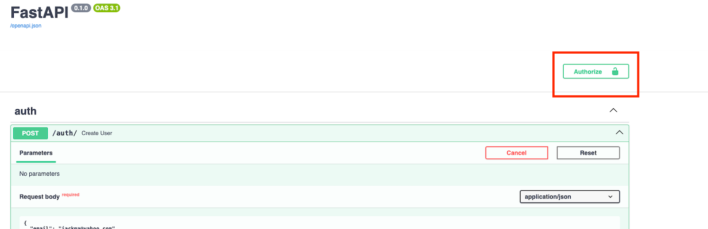
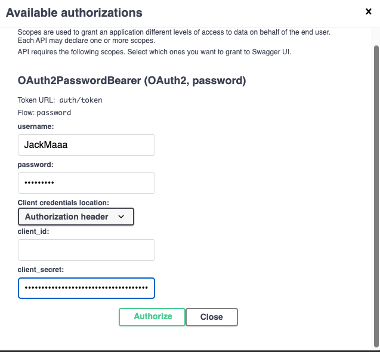

# Team TMD - Bug Bash!

### URL to App:
    - http://ec2-3-15-210-160.us-east-2.compute.amazonaws.com:8000/docs

### How to Use the App:
    1. Create a User 
        - Use the the POST /auth/ API route.
        - Your user type determines the level of access that you will have.
        - Admin have the highest level of privilege.
 

 

    2. Generate your Access token 
        - Use THE POST /auth/token/ to get your access token.
        - Enter you username and password to generate the token.
        - If the response is successful, then you will be returned an access token. 
 

 

 

    3. Authorize your User
        - In the top right hand corner, click the Authorize button.
        - Enter your username and password.
        - Enter your access token under client_secret.

 

 

 

 

    4. Use the App!
        - Based on your role, you will have access to varying api routes!

### Github Issues Page:
    - https://github.com/teamTMD/opp-api/issues