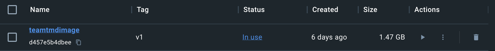
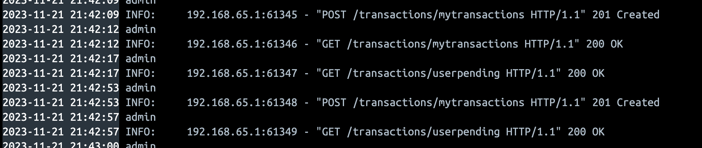
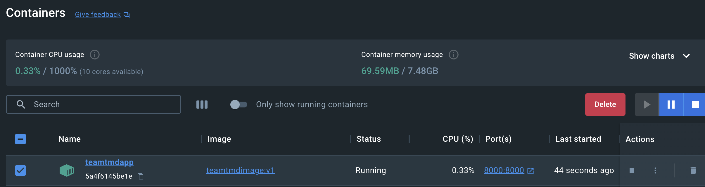

# opp-api

## Team TMD: 
    - Trenton Creamer
    - Marcela Vijil 
    - Derek Laister

## Directions:
    - Add .env file 
        - Add a SECRET_KEY variable
        - Add an ALGORITHM variable

# Milestone 4A Submittal:
The docker file was built and used to generate a docker image. The docker image launched a docker container where
we were able to test our application. All of the rest API calls were working as expected in our testing. Below are all 
of the docker commands that we encountered when testing. 

Docker Image:
 

Docker Log Info:
 

Docker Container Running:
 

## Docker-related commands

- docker build -t teamtmdimage:v1 . 
- docker build -t teamtmdimage:latest . 

    - This is running the docker build command to generate our project image 
    - -t is letting us specify our name tag
    - . is looking at our root for a file called Dockerfile

- docker build --platform linux/amd64 -t team_tmd_image:v1.0 . 
    - M2 chip command 

- docker run --name teamtmdapp -p 8000:8000 teamtmdimage:v1
    - This command is launching our docker container from our image. 
    - --name is naming our container
    - -p is specifying our host(left) and apps(right) ports 
    - todoappimage:v1 this is telling which image and tag to run 

- docker stop teamtmdapp
    - stock our container by name 

- docker ps -a
    - look up all the contianers that we have 
    - ps stands for process status

- docker images
    - look up all of the docker images that we have 

- docker rmi ######
    - delete a docker image 

- docker rm #####
    - delete a docker container 

- docker tag team_tmd_image:v1.1 XXXXXXXXX/opp-app:latest
    - tag our image to push to ECR 
- ff1f
    - Sending the Dockerfile to the ECR

# Milestone 4B Submittal

- Public URL to APP:
    - http://ec2-3-15-210-160.us-east-2.compute.amazonaws.com:8000/docs
 
- aws ecr get-login-password --region us-ea`st-2 | docker login --username AWS --password-stdin 680546755927.dkr.ecr.us-east-2.amazonaws.com
    - Log into ECR
- docker run -d --name opp-api -p 8000:8000 680546755927.dkr.ecr.us-east-2.amazonaws.com/opp-app:v1.0
    - Run docker from EC2 instance

## Running Pylint 

- pylint models testing routers main.py